# Zero UI Emergency Assistance System — Diagrams

> Architectural, flow and interaction diagrams for the current implementation:
> a real Flutter Android app, a FastAPI backend with SQLite, and a realtime
> authority dashboard. Every diagram below matches code that exists in this repo.

---

## 1. High-Level System Architecture

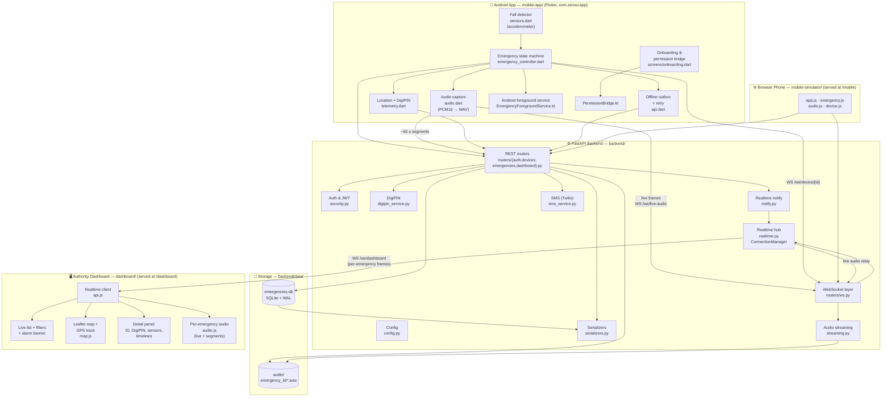
```mermaid
graph TB
    subgraph PHONE["📱 Android App — mobile-app/ (Flutter, com.zeroui.app)"]
        ONB["Onboarding &<br>permission bridge<br>screens/onboarding.dart"]
        SENSORS["Fall detector<br>sensors.dart<br>(accelerometer)"]
        CTRL["Emergency state machine<br>emergency_controller.dart"]
        AUDIO["Audio capture<br>audio.dart<br>(PCM16 → WAV)"]
        LOC["Location + DigiPIN<br>telemetry.dart"]
        OUTBOX["Offline outbox<br>+ retry<br>api.dart"]
        FGS["Android foreground service<br>EmergencyForegroundService.kt"]
        PERM["PermissionBridge.kt"]
    end

    subgraph SIM["🌐 Browser Phone — mobile-simulator/ (served at /mobile)"]
        SIMAPP["app.js · emergency.js<br>audio.js · device.js"]
    end

    subgraph BACKEND["⚙️ FastAPI Backend — backend/"]
        API["REST routers<br>routers/{auth,devices,<br>emergencies,dashboard}.py"]
        WS["WebSocket layer<br>routers/ws.py"]
        HUB["Realtime hub<br>realtime.py<br>ConnectionManager"]
        SEC["Auth & JWT<br>security.py"]
        CFG["Config<br>config.py"]
        DIG["DigiPIN<br>digipin_service.py"]
        SER["Serializers<br>serializers.py"]
        NOTIF["Realtime notify<br>notify.py"]
        SMS["SMS (Twilio)<br>sms_service.py"]
        STREAM["Audio streaming<br>streaming.py"]
    end

    subgraph DATA["💾 Storage — backend/data/"]
        DB[("emergencies.db<br>SQLite + WAL")]
        FILES[("audio/<br>emergency_id/*.wav")]
    end

    subgraph DASH["🖥️ Authority Dashboard — dashboard/ (served at /dashboard)"]
        DLIST["Live list + filters<br>+ alarm banner"]
        DMAP["Leaflet map +<br>GPS track<br>map.js"]
        DDETAIL["Detail panel:<br>ID, DigiPIN, sensors,<br>timelines"]
        DAUDIO["Per-emergency audio<br>audio.js<br>(live + segments)"]
        DWS["Realtime client<br>api.js"]
    end

    SENSORS --> CTRL
    ONB --> PERM
    CTRL --> FGS
    CTRL --> AUDIO
    CTRL --> LOC
    CTRL --> OUTBOX
    CTRL --> API
    AUDIO -->|"~60 s segments"| API
    AUDIO -->|"live frames<br>WS /ws/live-audio"| WS
    LOC --> API
    OUTBOX --> API
    CTRL -->|"WS /ws/device/{id}"| WS
    SIMAPP --> API
    SIMAPP --> WS

    API --> SEC
    API --> SER
    API --> DIG
    API --> DB
    API --> FILES
    API --> NOTIF
    API --> SMS
    WS --> HUB
    WS --> STREAM
    STREAM --> FILES
    NOTIF --> HUB
    HUB -->|"WS /ws/dashboard<br>(per-emergency frames)"| DWS
    HUB -->|"live audio relay"| WS
    DB --> SER

    DWS --> DLIST
    DWS --> DMAP
    DWS --> DDETAIL
    DWS --> DAUDIO
```

### Component responsibilities

| Component | Key files | Responsibility |
| --- | --- | --- |
| Android app | `lib/emergency_controller.dart` | The whole emergency state machine; owns timers, outbox, sockets |
| | `lib/sensors.dart` | Free-fall → impact → stillness detection |
| | `lib/audio.dart` | PCM16 capture, WAV packaging, ~60 s rotation, live framing |
| | `lib/telemetry.dart` | Location fixes, battery/network/service telemetry |
| | `lib/api.dart` | REST client, offline outbox, WebSocket reconnect with backoff |
| | `android/.../*.kt` | Foreground service + runtime permission requests |
| Backend | `routers/emergencies.py` | Emergency lifecycle (the only writer of emergency state) |
| | `routers/ws.py` | Three sockets: dashboard, device, live audio |
| | `realtime.py` | `ConnectionManager` — fan-out keyed by `emergency_id` |
| | `notify.py` | Builds and broadcasts the realtime messages |
| | `digipin_service.py` | Real India Post DIGIPIN generation |
| | `migrations.py` | Idempotent schema + additive migrations |
| Dashboard | `dashboard/app.js` | State store, list/detail rendering, realtime handling |
| | `dashboard/map.js` | Leaflet map, markers, GPS track (idempotent init) |
| | `dashboard/audio.js` | Live audio player + segment player, scoped per emergency |

---

## 2. Emergency State Machine

### 2.1 Device phases (Android app)

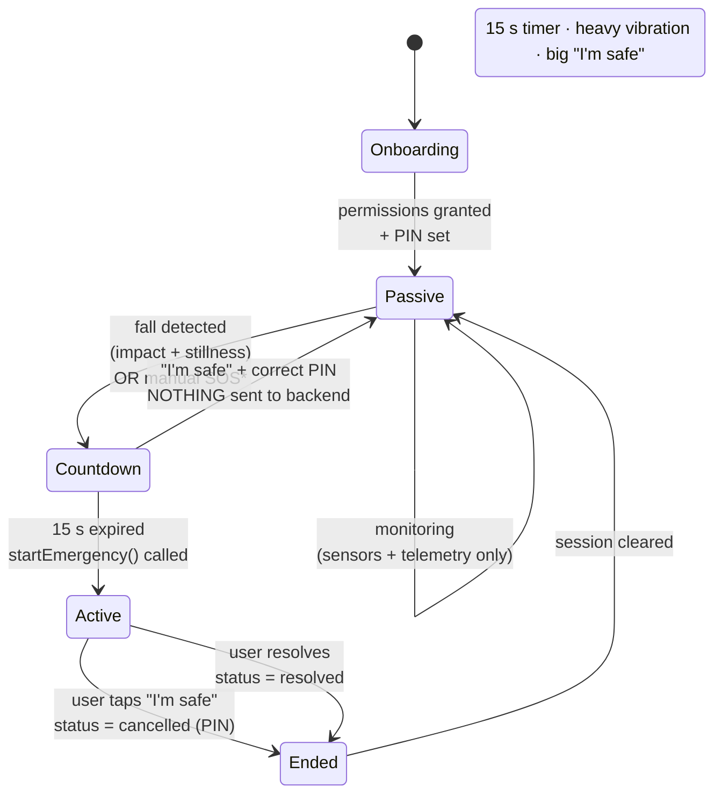
```mermaid
stateDiagram-v2
    [*] --> Onboarding
    Onboarding --> Passive: permissions granted<br>+ PIN set
    Passive --> Countdown: fall detected<br>(impact + stillness)<br>OR manual SOS<span>*</span>
    countdown_note: 15 s timer · heavy vibration · big "I'm safe"
    Countdown --> Passive: "I'm safe" + correct PIN<br>NOTHING sent to backend
    Countdown --> Active: 15 s expired<br>startEmergency() called
    Active --> Ended: user taps "I'm safe"<br>status = cancelled (PIN)
    Active --> Ended: user resolves<br>status = resolved
    Ended --> Passive: session cleared
    Passive --> Passive: monitoring<br>(sensors + telemetry only)
```

> `*` Manual SOS skips the countdown by design: the user asked for help, so there
> is nothing to cancel.

### 2.2 Server-side status values

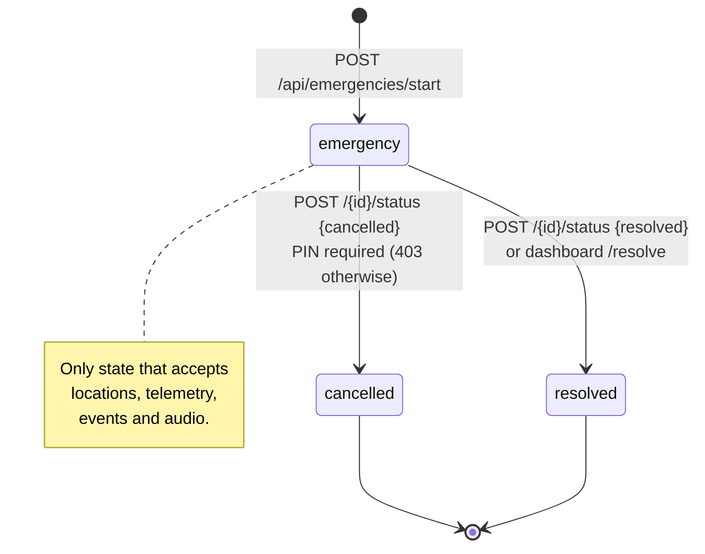
```mermaid
stateDiagram-v2
    [*] --> emergency: POST /api/emergencies/start
    emergency --> cancelled: POST /{id}/status {cancelled}<br>PIN required (403 otherwise)
    emergency --> resolved: POST /{id}/status {resolved}<br>or dashboard /resolve
    cancelled --> [*]
    resolved --> [*]

    note right of emergency
        Only state that accepts
        locations, telemetry,
        events and audio.
    end note
```

Request-level guard: a user with an active emergency gets `409 Conflict` from
`/start`, carrying the existing `emergency_id`. A retry with the same
`client_emergency_id` returns the original record (`created: false`) instead.

### 2.3 Dashboard-visible states

| Displayed state | Derived from | Meaning |
| --- | --- | --- |
| `EMERGENCY` + `LIVE` | `status=emergency`, last update ≤ 90 s | Active, phone reporting |
| `EMERGENCY` + `STALE` | `status=emergency`, last update > 90 s | Active but not reporting — `⚠ no updates 217s` |
| `CANCELLED` + `ENDED` | `status=cancelled` | User confirmed safe with PIN after activation |
| `RESOLVED` + `ENDED` | `status=resolved` | Closed by device or authority |

---

## 3. Fall Detection Pipeline (on-device)

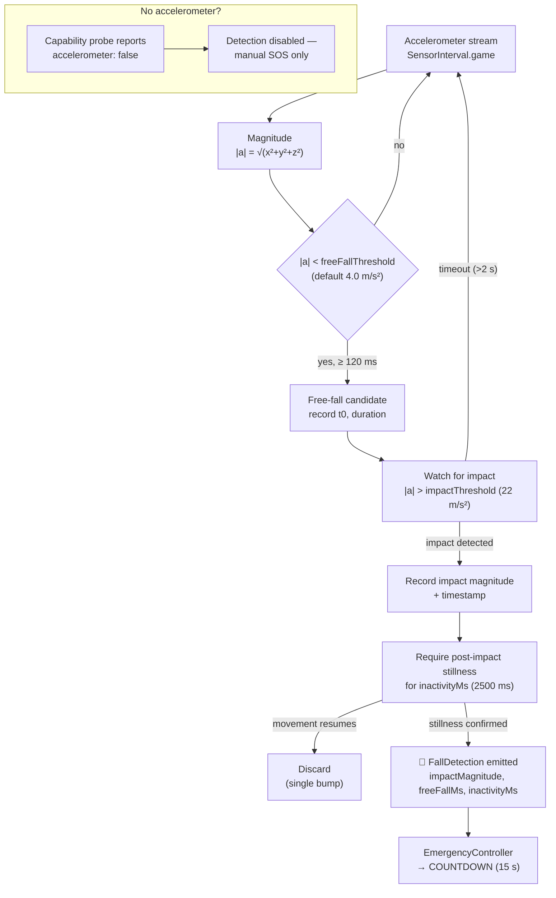
```mermaid
flowchart TD
    A["Accelerometer stream<br>SensorInterval.game"] --> B["Magnitude<br>|a| = √(x²+y²+z²)"]
    B --> C{"|a| < freeFallThreshold<br>(default 4.0 m/s²)"}
    C -->|no| A
    C -->|yes, ≥ 120 ms| D["Free-fall candidate<br>record t0, duration"]
    D --> E["Watch for impact<br>|a| > impactThreshold (22 m/s²)"]
    E -->|impact detected| F["Record impact magnitude<br>+ timestamp"]
    E -->|"timeout (>2 s)"| A
    F --> G["Require post-impact stillness<br>for inactivityMs (2500 ms)"]
    G -->|movement resumes| H["Discard<br>(single bump)"]
    G -->|stillness confirmed| I["🚨 FallDetection emitted<br>impactMagnitude, freeFallMs, inactivityMs"]
    I --> J["EmergencyController<br>→ COUNTDOWN (15 s)"]

    subgraph NO_ACCEL["No accelerometer?"]
        K["Capability probe reports<br>accelerometer: false"]
        L["Detection disabled —<br>manual SOS only"]
        K --> L
    end
```

The three-stage shape (free-fall → impact → stillness) is what keeps a dropped
phone in a pocket from firing: a single bump never satisfies the sequence.
Thresholds live in `DetectionSettings` and are user-tunable in Settings.

---

## 4. Countdown & Safe-Cancel Flow

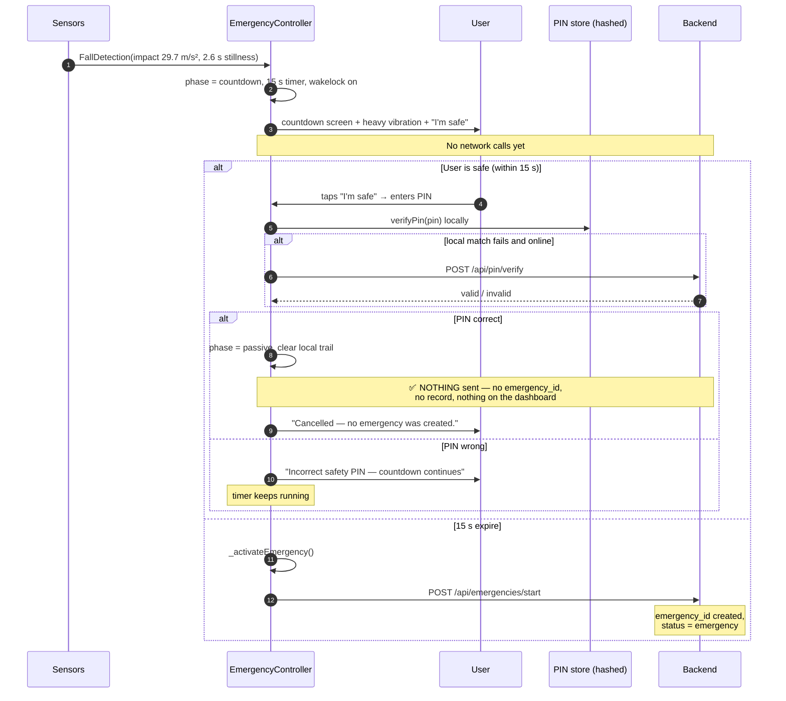
```mermaid
sequenceDiagram
    autonumber
    participant S as Sensors
    participant C as EmergencyController
    participant U as User
    participant P as PIN store (hashed)
    participant B as Backend

    S->>C: FallDetection(impact 29.7 m/s², 2.6 s stillness)
    C->>C: phase = countdown, 15 s timer, wakelock on
    C->>U: countdown screen + heavy vibration + "I'm safe"
    Note over C,B: No network calls yet

    alt User is safe (within 15 s)
        U->>C: taps "I'm safe" → enters PIN
        C->>P: verifyPin(pin) locally
        alt local match fails and online
            C->>B: POST /api/pin/verify
            B-->>C: valid / invalid
        end
        alt PIN correct
            C->>C: phase = passive, clear local trail
            Note over C,B: ✅ NOTHING sent — no emergency_id,<br>no record, nothing on the dashboard
            C->>U: "Cancelled — no emergency was created."
        else PIN wrong
            C->>U: "Incorrect safety PIN — countdown continues"
            Note over C: timer keeps running
        end
    else 15 s expire
        C->>C: _activateEmergency()
        C->>B: POST /api/emergencies/start
        Note over B: emergency_id created,<br>status = emergency
    end
```

This is the difference between a *cancel* and a *resolve*: a cancel inside the
countdown window is invisible to authorities; a cancel after activation is an
audited `cancelled` record.

---

## 5. Emergency Activation — Full Sequence

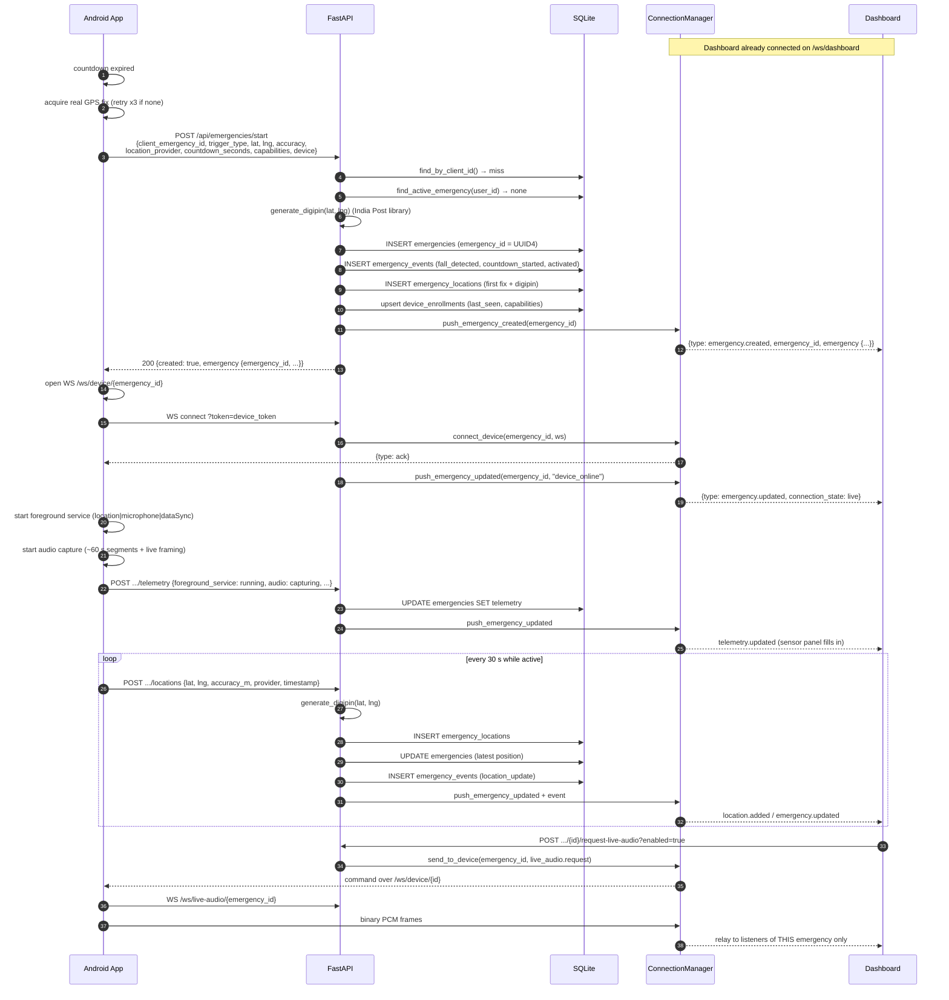
```mermaid
sequenceDiagram
    autonumber
    participant App as Android App
    participant API as FastAPI
    participant DB as SQLite
    participant Hub as ConnectionManager
    participant Dash as Dashboard

    Note over Dash,Hub: Dashboard already connected on /ws/dashboard

    App->>App: countdown expired
    App->>App: acquire real GPS fix (retry x3 if none)
    App->>API: POST /api/emergencies/start<br/>{client_emergency_id, trigger_type, lat, lng, accuracy,<br> location_provider, countdown_seconds, capabilities, device}
    API->>DB: find_by_client_id() → miss
    API->>DB: find_active_emergency(user_id) → none
    API->>API: generate_digipin(lat, lng)  (India Post library)
    API->>DB: INSERT emergencies (emergency_id = UUID4)
    API->>DB: INSERT emergency_events (fall_detected, countdown_started, activated)
    API->>DB: INSERT emergency_locations (first fix + digipin)
    API->>DB: upsert device_enrollments (last_seen, capabilities)
    API->>Hub: push_emergency_created(emergency_id)
    Hub-->>Dash: {type: emergency.created, emergency_id, emergency {...}}
    API-->>App: 200 {created: true, emergency {emergency_id, ...}}

    App->>App: open WS /ws/device/{emergency_id}
    App->>API: WS connect ?token=device_token
    API->>Hub: connect_device(emergency_id, ws)
    Hub-->>App: {type: ack}
    API->>Hub: push_emergency_updated(emergency_id, "device_online")
    Hub-->>Dash: {type: emergency.updated, connection_state: live}

    App->>App: start foreground service (location|microphone|dataSync)
    App->>App: start audio capture (~60 s segments + live framing)
    App->>API: POST .../telemetry {foreground_service: running, audio: capturing, ...}
    API->>DB: UPDATE emergencies SET telemetry
    API->>Hub: push_emergency_updated
    Hub-->>Dash: telemetry.updated (sensor panel fills in)

    loop every 30 s while active
        App->>API: POST .../locations {lat, lng, accuracy_m, provider, timestamp}
        API->>API: generate_digipin(lat, lng)
        API->>DB: INSERT emergency_locations
        API->>DB: UPDATE emergencies (latest position)
        API->>DB: INSERT emergency_events (location_update)
        API->>Hub: push_emergency_updated + event
        Hub-->>Dash: location.added / emergency.updated
    end

    Dash->>API: POST .../{id}/request-live-audio?enabled=true
    API->>Hub: send_to_device(emergency_id, live_audio.request)
    Hub-->>App: command over /ws/device/{id}
    App->>API: WS /ws/live-audio/{emergency_id}
    App->>Hub: binary PCM frames
    Hub-->>Dash: relay to listeners of THIS emergency only
```

---

## 6. Location & DigiPIN Flow

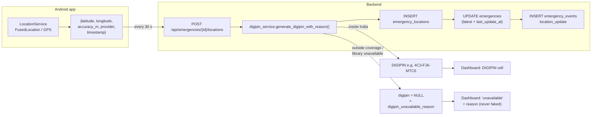
```mermaid
flowchart LR
    subgraph DEVICE["Android app"]
        POS["LocationService<br>FusedLocation / GPS"]
        PAY["{latitude, longitude,<br>accuracy_m, provider,<br>timestamp}"]
        POS --> PAY
    end

    subgraph SRV["Backend"]
        EP["POST /api/emergencies/{id}/locations"]
        GEN["digipin_service.generate_digipin_with_reason()"]
        INS["INSERT emergency_locations"]
        UPD["UPDATE emergencies<br>(latest + last_update_at)"]
        EVT["INSERT emergency_events<br>location_update"]
        EP --> GEN --> INS --> UPD --> EVT
    end

    PAY -->|"every 30 s"| EP
    GEN -->|inside India| OK["DIGIPIN e.g. 4C3-FJ6-MTC6"]
    GEN -->|"outside coverage /<br>library unavailable"| NONE["digipin = NULL<br>+ digipin_unavailable_reason"]

    OK --> DASH["Dashboard: DIGIPIN cell"]
    NONE --> DASH2["Dashboard: 'unavailable'<br>+ reason (never faked)"]
```

**Why the server generates it.** The device only sends lat/lng; the DIGIPIN is
computed server-side so every consumer sees the same code derived from the same
library version. The real `digipin` package (India Post algorithm, 4-3-4 groups)
returns `None` outside India — that is stored as a reason, not invented.

---

## 7. Audio Pipeline

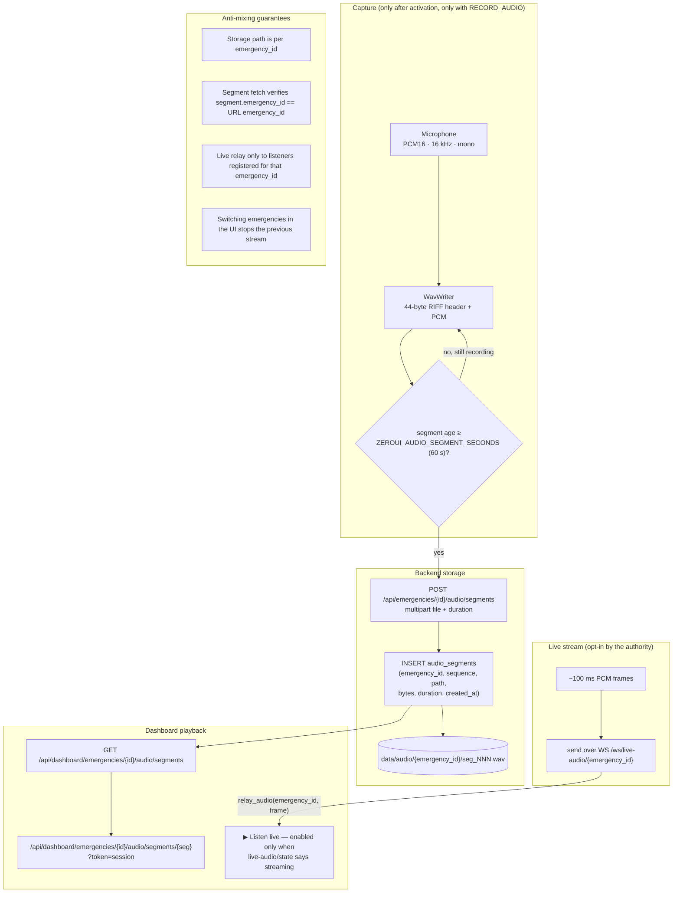
```mermaid
flowchart TB
    subgraph CAP["Capture (only after activation, only with RECORD_AUDIO)"]
        MIC["Microphone<br>PCM16 · 16 kHz · mono"]
        WAV["WavWriter<br>44-byte RIFF header + PCM"]
        ROT{"segment age ≥<br>ZEROUI_AUDIO_SEGMENT_SECONDS (60 s)?"}
        MIC --> WAV --> ROT
    end

    ROT -->|yes| UP["POST /api/emergencies/{id}/audio/segments<br>multipart file + duration"]
    ROT -->|no, still recording| WAV

    subgraph LIVE["Live stream (opt-in by the authority)"]
        FRAME["~100 ms PCM frames"]
        WSEND["send over WS /ws/live-audio/{emergency_id}"]
        FRAME --> WSEND
    end

    subgraph STORE["Backend storage"]
        SEG["INSERT audio_segments<br>(emergency_id, sequence, path,<br>bytes, duration, created_at)"]
        FILE[("data/audio/{emergency_id}/seg_NNN.wav")]
        UP --> SEG --> FILE
    end

    subgraph PLAY["Dashboard playback"]
        LIST["GET /api/dashboard/emergencies/{id}/audio/segments"]
        SRC["/api/dashboard/emergencies/{id}/audio/segments/{seg}<br>?token=session"]
        LIVEBTN["▶ Listen live — enabled only when<br>live-audio/state says streaming"]
        LIST --> SRC
    end

    SEG --> LIST
    WSEND -->|"relay_audio(emergency_id, frame)"| LIVEBTN

    subgraph ISOLATION["Anti-mixing guarantees"]
        I1["Storage path is per emergency_id"]
        I2["Segment fetch verifies segment.emergency_id == URL emergency_id"]
        I3["Live relay only to listeners registered for that emergency_id"]
        I4["Switching emergencies in the UI stops the previous stream"]
    end
```

---

## 8. Realtime Fan-out Architecture

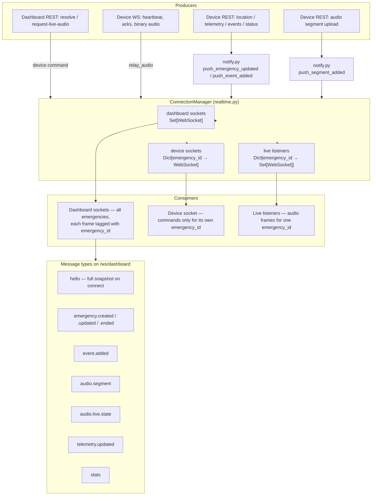
```mermaid
flowchart TB
    subgraph CM["ConnectionManager (realtime.py)"]
        DL["dashboard sockets<br>Set[WebSocket]"]
        DS["device sockets<br>Dict[emergency_id → WebSocket]"]
        LL["live listeners<br>Dict[emergency_id → Set[WebSocket]]"]
    end

    subgraph PRODUCERS["Producers"]
        R1["Device REST: location / telemetry / events / status"]
        R2["Device REST: audio segment upload"]
        R3["Dashboard REST: resolve / request-live-audio"]
        R4["Device WS: heartbeat, acks, binary audio"]
    end

    subgraph CONSUMERS["Consumers"]
        C1["Dashboard sockets — all emergencies,<br>each frame tagged with emergency_id"]
        C2["Device socket — commands only for its own emergency_id"]
        C3["Live listeners — audio frames for one emergency_id"]
    end

    R1 --> N["notify.py<br>push_emergency_updated / push_event_added"]
    R2 --> N2["notify.py<br>push_segment_added"]
    R3 -->|device command| CM
    R4 -->|"relay_audio"| CM
    N --> CM
    N2 --> CM
    CM --> DL --> C1
    CM --> DS --> C2
    CM --> LL --> C3

    subgraph MSGS["Message types on /ws/dashboard"]
        M1["hello — full snapshot on connect"]
        M2["emergency.created / .updated / .ended"]
        M3["event.added"]
        M4["audio.segment"]
        M5["audio.live.state"]
        M6["telemetry.updated"]
        M7["stats"]
    end
    C1 --> MSGS
```

**Isolation rule:** every message carries `emergency_id`, and the hub only sends
device-directed or audio frames to the sockets registered for that exact ID. A
dashboard session for one emergency cannot receive another's audio frames, and
the audio file endpoint re-checks ownership on every request.

---

## 9. Dashboard Data Flow

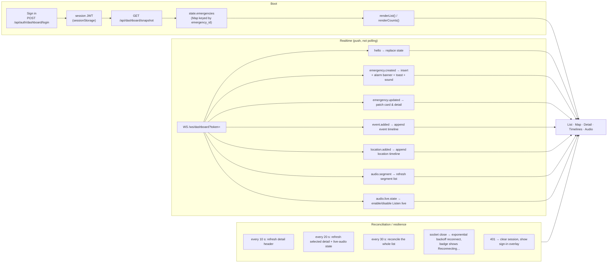
```mermaid
flowchart LR
    subgraph BOOT["Boot"]
        L["Sign in<br>POST /api/auth/dashboard/login"] --> T["session JWT<br>(sessionStorage)"]
        T --> S["GET /api/dashboard/snapshot"]
        S --> ST["state.emergencies<br>(Map keyed by emergency_id)"]
        ST --> REN["renderList() / renderCounts()"]
    end

    subgraph RT["Realtime (push, not polling)"]
        WS["WS /ws/dashboard?token="] --> HELLO["hello → replace state"]
        WS --> CR["emergency.created → insert<br>+ alarm banner + toast + sound"]
        WS --> UP["emergency.updated → patch card & detail"]
        WS --> EV["event.added → append event timeline"]
        WS --> LOC["location.added → append location timeline"]
        WS --> SEG["audio.segment → refresh segment list"]
        WS --> LA["audio.live.state → enable/disable Listen live"]
    end

    subgraph SAFETY["Reconciliation / resilience"]
        T1["every 10 s: refresh detail header"]
        T2["every 20 s: refresh selected detail + live-audio state"]
        T3["every 30 s: reconcile the whole list"]
        T4["socket close → exponential backoff reconnect,<br>badge shows Reconnecting…"]
        T5["401 → clear session, show sign-in overlay"]
    end

    REN --> UI["List · Map · Detail · Timelines · Audio"]
    HELLO --> UI
    CR --> UI
    UP --> UI
    EV --> UI
    LOC --> UI
    SEG --> UI
    LA --> UI
    SAFETY --> UI
```

The dashboard never polls for emergencies: it reacts to socket frames and only
runs timers as a safety net (and to re-render relative timestamps). The
connection badge reflects the real socket state: `Live` / `Reconnecting…` /
`Offline`.

---

## 10. API Endpoint Map

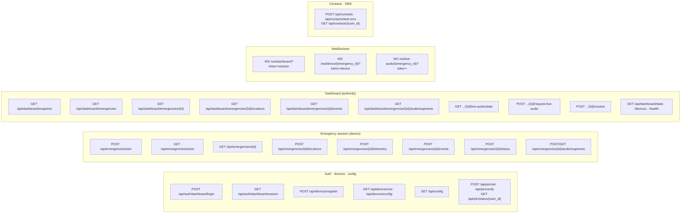
```mermaid
graph LR
    subgraph AUTH["Auth · devices · config"]
        A1["POST /api/auth/dashboard/login"]
        A2["GET /api/auth/dashboard/session"]
        A3["POST /api/devices/register"]
        A4["GET /api/devices/me · /api/devices/config"]
        A5["GET /api/config"]
        A6["POST /api/pin/set · /api/pin/verify<br>GET /api/pin/status/{user_id}"]
    end

    subgraph EMG["Emergency session (device)"]
        E1["POST /api/emergencies/start"]
        E2["GET /api/emergencies/active"]
        E3["GET /api/emergencies/{id}"]
        E4["POST /api/emergencies/{id}/locations"]
        E5["POST /api/emergencies/{id}/telemetry"]
        E6["POST /api/emergencies/{id}/events"]
        E7["POST /api/emergencies/{id}/status"]
        E8["POST/GET /api/emergencies/{id}/audio/segments"]
    end

    subgraph DSH["Dashboard (authority)"]
        D1["GET /api/dashboard/snapshot"]
        D2["GET /api/dashboard/emergencies"]
        D3["GET /api/dashboard/emergencies/{id}"]
        D4["GET /api/dashboard/emergencies/{id}/locations"]
        D5["GET /api/dashboard/emergencies/{id}/events"]
        D6["GET /api/dashboard/emergencies/{id}/audio/segments"]
        D7["GET .../{id}/live-audio/state"]
        D8["POST .../{id}/request-live-audio"]
        D9["POST .../{id}/resolve"]
        D10["GET /api/dashboard/stats · /devices · /health"]
    end

    subgraph SOC["WebSockets"]
        W1["WS /ws/dashboard?token=session"]
        W2["WS /ws/device/{emergency_id}?token=device"]
        W3["WS /ws/live-audio/{emergency_id}?token="]
    end

    subgraph CONTACTS["Contacts · SMS"]
        C1["POST /api/contacts · /api/contacts/test-sms<br>GET /api/contacts/{user_id}"]
    end
```

Static mounts: `/dashboard/` (console), `/mobile/` (browser phone), `/` → redirect
to `/dashboard/`, `/docs` (OpenAPI).

---

## 11. Database Entity Relationship

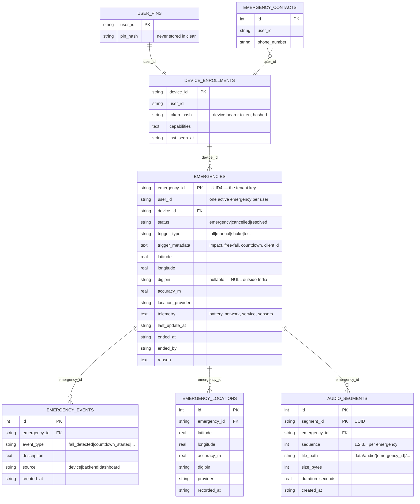
```mermaid
erDiagram
    DEVICE_ENROLLMENTS ||--o{ EMERGENCIES : "device_id"
    EMERGENCIES ||--o{ EMERGENCY_EVENTS : "emergency_id"
    EMERGENCIES ||--o{ EMERGENCY_LOCATIONS : "emergency_id"
    EMERGENCIES ||--o{ AUDIO_SEGMENTS : "emergency_id"
    USER_PINS ||--|| DEVICE_ENROLLMENTS : "user_id"
    EMERGENCY_CONTACTS }o--|| DEVICE_ENROLLMENTS : "user_id"

    EMERGENCIES {
        string emergency_id PK "UUID4 — the tenant key"
        string user_id "one active emergency per user"
        string device_id FK
        string status "emergency|cancelled|resolved"
        string trigger_type "fall|manual|shake|test"
        text trigger_metadata "impact, free-fall, countdown, client id"
        real latitude
        real longitude
        string digipin "nullable — NULL outside India"
        real accuracy_m
        string location_provider
        text telemetry "battery, network, service, sensors"
        string last_update_at
        string ended_at
        string ended_by
        text reason
    }
    EMERGENCY_LOCATIONS {
        int id PK
        string emergency_id FK
        real latitude
        real longitude
        real accuracy_m
        string digipin
        string provider
        string recorded_at
    }
    EMERGENCY_EVENTS {
        int id PK
        string emergency_id FK
        string event_type "fall_detected|countdown_started|..."
        text description
        string source "device|backend|dashboard"
        string created_at
    }
    AUDIO_SEGMENTS {
        int id PK
        string segment_id PK "UUID"
        string emergency_id FK
        int sequence "1,2,3... per emergency"
        string file_path "data/audio/{emergency_id}/..."
        int size_bytes
        real duration_seconds
        string created_at
    }
    DEVICE_ENROLLMENTS {
        string device_id PK
        string user_id
        string token_hash "device bearer token, hashed"
        text capabilities
        string last_seen_at
    }
    USER_PINS {
        string user_id PK
        string pin_hash "never stored in clear"
    }
    EMERGENCY_CONTACTS {
        int id PK
        string user_id
        string phone_number
    }
```

---

## 12. One-Active-Emergency & Isolation Enforcement

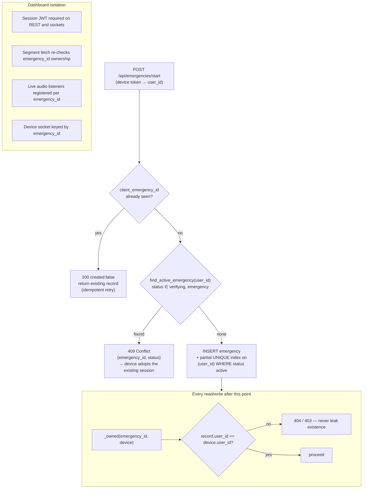
```mermaid
flowchart TD
    REQ["POST /api/emergencies/start<br>(device token → user_id)"] --> CID{"client_emergency_id<br>already seen?"}
    CID -->|yes| DUP["200 created:false<br>return existing record<br>(idempotent retry)"]
    CID -->|no| ACT{"find_active_emergency(user_id)<br>status ∈ verifying, emergency"}
    ACT -->|found| C409["409 Conflict<br>{emergency_id, status}<br>→ device adopts the existing session"]
    ACT -->|none| INS["INSERT emergency<br>+ partial UNIQUE index on<br>(user_id) WHERE status active"]

    subgraph ISO["Every read/write after this point"]
        P["_owned(emergency_id, device)"]
        P --> P1{"record.user_id == device.user_id?"}
        P1 -->|no| F["404 / 403 — never leak existence"]
        P1 -->|yes| OK["proceed"]
    end
    INS --> ISO

    subgraph DASHISO["Dashboard isolation"]
        D1["Session JWT required on REST and sockets"]
        D2["Segment fetch re-checks emergency_id ownership"]
        D3["Live audio listeners registered per emergency_id"]
        D4["Device socket keyed by emergency_id"]
    end
```

The partial unique index means the one-active rule holds even under concurrent
`/start` calls, not just from application checks.

---

## 13. Cancel / Resolve Flows

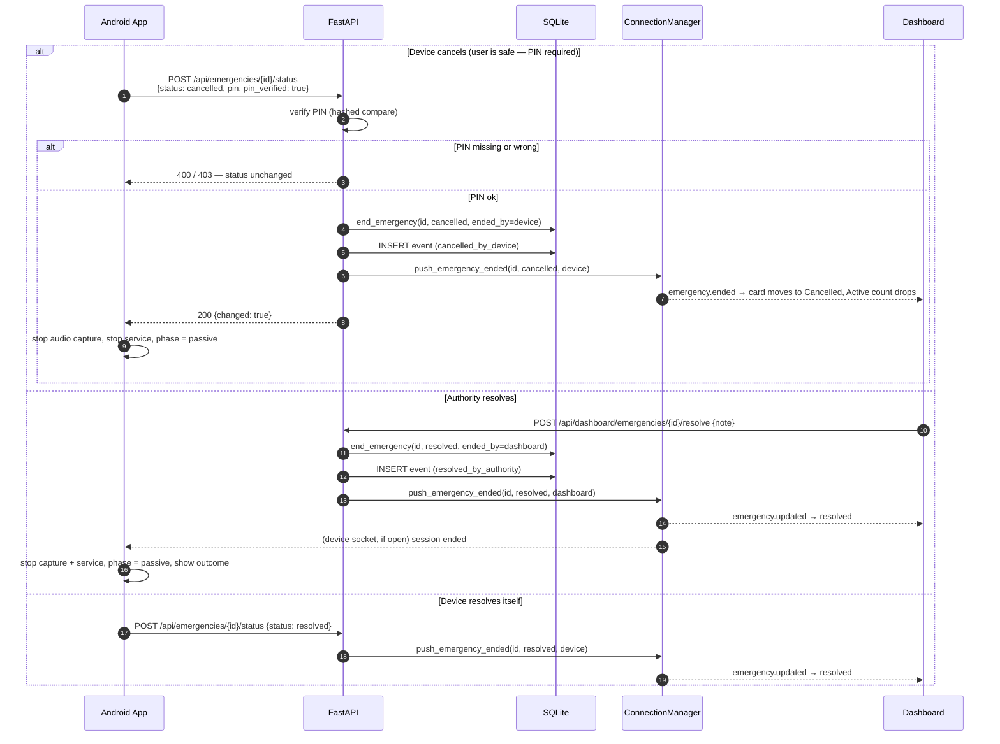
```mermaid
sequenceDiagram
    autonumber
    participant App as Android App
    participant API as FastAPI
    participant DB as SQLite
    participant Hub as ConnectionManager
    participant Dash as Dashboard

    alt Device cancels (user is safe — PIN required)
        App->>API: POST /api/emergencies/{id}/status<br/>{status: cancelled, pin, pin_verified: true}
        API->>API: verify PIN (hashed compare)
        alt PIN missing or wrong
            API-->>App: 400 / 403 — status unchanged
        else PIN ok
            API->>DB: end_emergency(id, cancelled, ended_by=device)
            API->>DB: INSERT event (cancelled_by_device)
            API->>Hub: push_emergency_ended(id, cancelled, device)
            Hub-->>Dash: emergency.ended → card moves to Cancelled, Active count drops
            API-->>App: 200 {changed: true}
            App->>App: stop audio capture, stop service, phase = passive
        end
    else Authority resolves
        Dash->>API: POST /api/dashboard/emergencies/{id}/resolve {note}
        API->>DB: end_emergency(id, resolved, ended_by=dashboard)
        API->>DB: INSERT event (resolved_by_authority)
        API->>Hub: push_emergency_ended(id, resolved, dashboard)
        Hub-->>Dash: emergency.updated → resolved
        Hub-->>App: (device socket, if open) session ended
        App->>App: stop capture + service, phase = passive, show outcome
    else Device resolves itself
        App->>API: POST /api/emergencies/{id}/status {status: resolved}
        API->>Hub: push_emergency_ended(id, resolved, device)
        Hub-->>Dash: emergency.updated → resolved
    end
```

`end_emergency()` is idempotent: a second call for an already-ended emergency
returns `changed: false` instead of erroring, so retries are safe.

---

## 14. Connectivity Loss & Reconnection

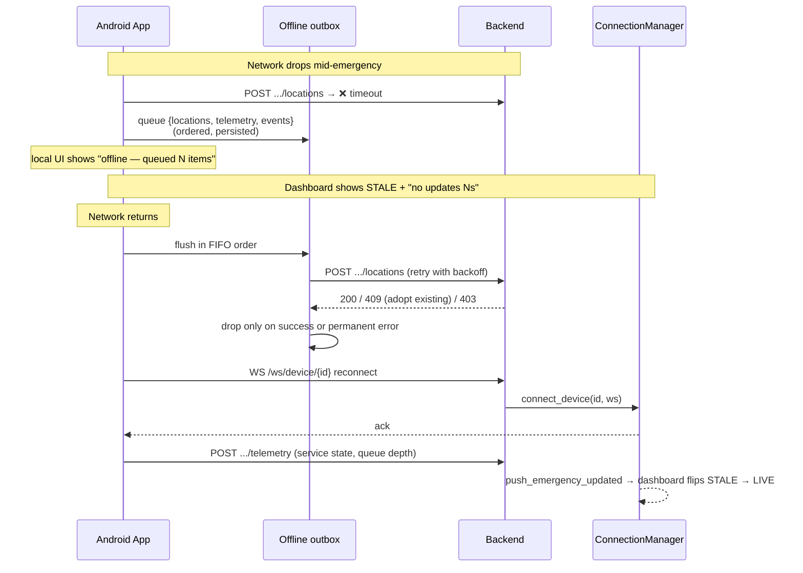
```mermaid
sequenceDiagram
    participant App as Android App
    participant OB as Offline outbox
    participant API as Backend
    participant Hub as ConnectionManager

    Note over App,API: Network drops mid-emergency
    App->>API: POST .../locations → ❌ timeout
    App->>OB: queue {locations, telemetry, events}<br>(ordered, persisted)
    Note over App: local UI shows "offline — queued N items"
    Note over App,Hub: Dashboard shows STALE + "no updates Ns"

    Note over App: Network returns
    App->>OB: flush in FIFO order
    OB->>API: POST .../locations (retry with backoff)
    API-->>OB: 200 / 409 (adopt existing) / 403
    OB->>OB: drop only on success or permanent error
    App->>API: WS /ws/device/{id} reconnect
    API->>Hub: connect_device(id, ws)
    Hub-->>App: ack
    App->>API: POST .../telemetry (service state, queue depth)
    Hub-->>Hub: push_emergency_updated → dashboard flips STALE → LIVE
```

The app never fabricates data to fill a gap: it reports the queue depth as
telemetry so the authority can see the gap in the timeline instead of a
misleadingly continuous track.

---

## 15. Project File Structure

```mermaid
graph TB
    ROOT["zeroui/"]

    ROOT --> BE["backend/"]
    BE --> BE1["main.py — FastAPI app, CORS, static mounts,<br>error handlers, /api/config"]
    BE --> BE2["config.py — env-driven settings + production validation"]
    BE --> BE3["security.py — device tokens, JWT sessions, PIN hashing"]
    BE --> BE4["database.py — aiosqlite layer, WAL, one-active queries"]
    BE --> BE5["migrations.py — idempotent schema + additive migrations"]
    BE --> BE6["models.py — Pydantic request/response models"]
    BE --> BE7["serializers.py — DB row → API shape (summary/detail/bundle)"]
    BE --> BE8["realtime.py — ConnectionManager (dashboard/device/listeners)"]
    BE --> BE9["notify.py — realtime message builders"]
    BE --> BE10["digipin_service.py — India Post DIGIPIN (+ reason when unavailable)"]
    BE --> BE11["streaming.py — chunked audio file serving"]
    BE --> BE12["sms_service.py · notify.py — Twilio alerts (optional)"]
    BE --> BE13["routers/ — auth · devices · emergencies · dashboard · ws"]
    BE --> BE14["scripts/device_simulator.py — headless phone for demos/tests"]
    BE --> BE15["tests/ — digipin · emergency_api · isolation · e2e_live_server"]
    BE --> BE16[".env.example · requirements.txt · requirements-dev.txt"]
    BE --> BEDATA["data/ (gitignored) — emergencies.db · audio/{emergency_id}/"]

    ROOT --> DASH["dashboard/"]
    DASH --> D1["index.html — console + sign-in overlay"]
    DASH --> D2["app.js — state, rendering, realtime handling"]
    DASH --> D3["api.js — REST + socket client, session, backoff"]
    DASH --> D4["map.js — Leaflet map, markers, track (idempotent init)"]
    DASH --> D5["audio.js — live audio + per-emergency segments"]
    DASH --> D6["style.css · realtime.css · theme-light.css"]

    ROOT --> APP["mobile-app/ (Flutter, com.zeroui.app)"]
    APP --> A1["lib/main.dart — app shell, theming, routing"]
    APP --> A2["lib/emergency_controller.dart — state machine"]
    APP --> A3["lib/sensors.dart — fall detection"]
    APP --> A4["lib/audio.dart — PCM16 → WAV, segments, live frames"]
    APP --> A5["lib/telemetry.dart — location + device telemetry"]
    APP --> A6["lib/api.dart — REST, outbox, sockets"]
    APP --> A7["lib/foreground.dart — service bridge"]
    APP --> A8["lib/config.dart — build-time + persisted config"]
    APP --> A9["lib/models.dart · widgets.dart"]
    APP --> A10["lib/screens/ — onboarding · home · countdown · active · settings"]
    APP --> A11["android/.../MainActivity.kt · EmergencyForegroundService.kt ·<br>PermissionBridge.kt · AndroidManifest.xml"]
    APP --> A12["test/emergency_flow_test.dart"]

    ROOT --> SIMD["mobile-simulator/ — browser phone<br>(index.html · app.js · device.js · emergency.js · audio.js · sensors.js)"]
    ROOT --> DOCS["README.md · DIAGRAMS.md"]
    ROOT --> VENV["venv/ — Python 3.12 environment (gitignored)"]
```

---

## 16. End-to-End Sequence (all three components)

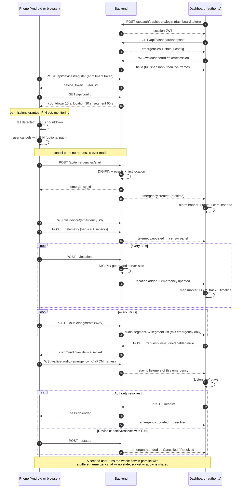
```mermaid
sequenceDiagram
    autonumber
    participant P as Phone (Android or browser)
    participant B as Backend
    participant D as Dashboard (authority)

    D->>B: POST /api/auth/dashboard/login (dashboard token)
    B-->>D: session JWT
    D->>B: GET /api/dashboard/snapshot
    B-->>D: emergencies + stats + config
    D->>B: WS /ws/dashboard?token=session
    B-->>D: hello (full snapshot), then live frames

    P->>B: POST /api/devices/register (enrollment token)
    B-->>P: device_token + user_id
    P->>B: GET /api/config
    B-->>P: countdown 15 s, location 30 s, segment 60 s

    Note over P: permissions granted, PIN set, monitoring
    P->>P: fall detected → 15 s countdown
    P->>P: user cancels with PIN (optional path)
    Note over P,B: cancel path: no request is ever made

    P->>B: POST /api/emergencies/start
    B->>B: DIGIPIN + events + first location
    B-->>P: emergency_id
    B-->>D: emergency.created (realtime)
    D->>D: alarm banner + toast + card inserted

    P->>B: WS /ws/device/{emergency_id}
    P->>B: POST .../telemetry (service + sensors)
    B-->>D: telemetry.updated → sensor panel

    loop every 30 s
        P->>B: POST .../locations
        B->>B: DIGIPIN generated server-side
        B-->>D: location.added + emergency.updated
        D->>D: map marker + GPS track + timeline
    end

    loop every ~60 s
        P->>B: POST .../audio/segments (WAV)
        B-->>D: audio.segment → segment list (this emergency only)
    end

    D->>B: POST .../request-live-audio?enabled=true
    B-->>P: command over device socket
    P->>B: WS /ws/live-audio/{emergency_id} (PCM frames)
    B-->>D: relay to listeners of this emergency
    D->>D: "Listen live" plays

    alt Authority resolves
        D->>B: POST .../resolve
        B-->>P: session ended
        B-->>D: emergency.updated → resolved
    else Device cancels/resolves with PIN
        P->>B: POST .../status
        B-->>D: emergency.ended → Cancelled / Resolved
    end

    Note over P,D: A second user runs the whole flow in parallel with<br>a different emergency_id — no state, socket or audio is shared
```

---

## 17. Deployment Topology

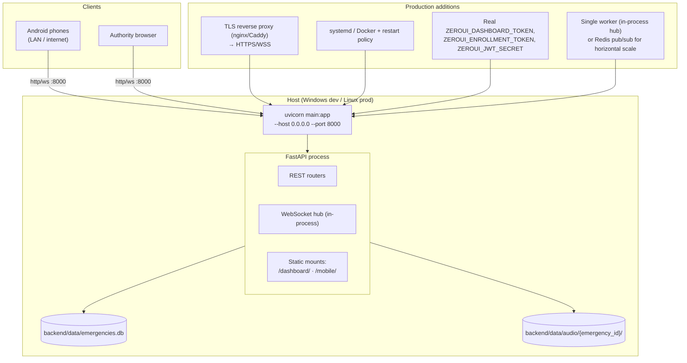
```mermaid
graph TB
    subgraph CLIENTS["Clients"]
        PH["Android phones<br>(LAN / internet)"]
        OPS["Authority browser"]
    end

    subgraph HOST["Host (Windows dev / Linux prod)"]
        UV["uvicorn main:app<br>--host 0.0.0.0 --port 8000"]
        subgraph APP["FastAPI process"]
            R["REST routers"]
            W["WebSocket hub (in-process)"]
            ST["Static mounts:<br>/dashboard/ · /mobile/"]
        end
        DBF[("backend/data/emergencies.db")]
        AU[("backend/data/audio/{emergency_id}/")]
        UV --> APP
        APP --> DBF
        APP --> AU
    end

    PH -->|"http/ws :8000"| UV
    OPS -->|"http/ws :8000"| UV

    subgraph PRODNOTES["Production additions"]
        TLS["TLS reverse proxy (nginx/Caddy)<br>→ HTTPS/WSS"]
        SYS["systemd / Docker + restart policy"]
        SEC["Real ZEROUI_DASHBOARD_TOKEN,<br>ZEROUI_ENROLLMENT_TOKEN, ZEROUI_JWT_SECRET"]
        SINGLE["Single worker (in-process hub)<br>or Redis pub/sub for horizontal scale"]
        TLS --> UV
        SYS --> UV
        SEC --> UV
        SINGLE --> UV
    end
```

---

## 18. Failure Modes & Handling

| Failure | Detection | Handling |
| --- | --- | --- |
| No GPS fix at activation | `_acquireLocation()` returns null | Retry (3×) before contacting the backend; the app never invents a coordinate |
| Network down | Request throws / socket closes | Locations, telemetry and events queue in the persisted outbox; socket reconnects with exponential backoff (0.5 s → 15 s cap) |
| Duplicate `/start` (retry after a lost response) | `client_emergency_id` match | Returns the original record, `created: false` |
| Second emergency for the same user | `find_active_emergency` + unique index | `409` with the existing `emergency_id`; device adopts that session |
| Android kills the service | Foreground-service state in telemetry | Dashboard shows the real service state; uploads resume on restart; segments are keyed by sequence so gaps stay visible |
| Microphone permission denied | Capability probe | Audio disabled; the session still runs location/telemetry/events and says audio is unavailable |
| Battery optimisation stops background work | Telemetry stops, dashboard flips to STALE | Onboarding requests the exemption; the dashboard distinguishes "stale" from "ended" |
| Dashboard session expires | REST 401 | Session cleared, sign-in overlay shown, no stale data left on screen |
| Socket drops while a detail view is open | `socket.onclose` | Badge → `Reconnecting…`; 20 s reconciliation refresh keeps the detail current |
| Audio requested for another emergency | Ownership check on the segment row | `404` — the file is never served across emergencies |
| Device outside India | `digipin` library returns `None` | DIGIPIN stored as NULL with a reason; the UI shows "unavailable" instead of a fake code |

---

## 19. Technology Stack

| Layer | Technology | Notes |
| --- | --- | --- |
| Android app | Flutter 3.41 / Dart 3 | `sensors_plus`, `geolocator`, `record`, `flutter_secure_storage`/`shared_preferences`, `web_socket_channel`, `wakelock_plus` |
| Native Android | Kotlin | `MainActivity`, `EmergencyForegroundService`, `PermissionBridge` |
| Backend | FastAPI 0.115 + uvicorn 0.30 | Async throughout; Pydantic models for every request |
| Database | SQLite via aiosqlite 0.20 | WAL, partial unique index for one-active-per-user |
| Realtime | FastAPI WebSockets | `ConnectionManager` fan-out keyed by `emergency_id` |
| Auth | PyJWT + hashed device tokens/PINs | Dashboard session JWT; device bearer tokens stored hashed |
| Location ID | `digipin` (India Post) | Real algorithm; returns nothing outside India |
| Audio | PCM16 16 kHz mono → WAV | ~60 s segments + live WebSocket frames |
| Dashboard | Vanilla JS + Leaflet 1.9 + OSM tiles | No build step; served straight from the backend |
| Notifications | Twilio (optional) | Disabled by default; logs `sms skipped` when unconfigured |
| Tests | pytest 8.3 + httpx (backend), flutter_test (app) | Includes a live two-user E2E test over real sockets |
